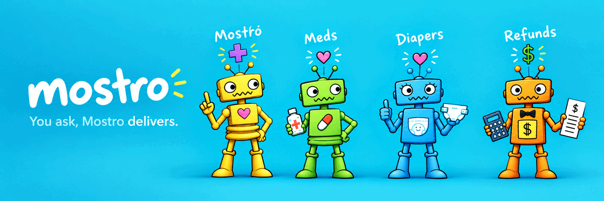

<h1 align="center">mostro-server</h1>

<p align="center">
  
</p>

<p align="center">
  An AI assistant that handles a family's recurring care errands: diapers, medications and refunds.
</p>

<p align="center">
  <a href="https://github.com/alex-bluetrain/mostro-server/releases"></a>
  
  
</p>

## Description

A [Mastra](https://mastra.ai) backend built as a **single-agent harness**: one agent loop, reached through
Telegram, Discord (optional) or [mostro-app](https://github.com/alex-bluetrain/mostro-app), with a minimal,
cache-friendly core prompt. Domain knowledge (diapers, meds, refunds) lives in **skills** the agent loads
on demand, and domain **tools are discovered via search** instead of being pinned to the prompt. A separate
internal agent classifies supplier emails.

- **Orders by email**: workflows send requests to suppliers from Mostro's own Gmail account.
- **Replies resume work**: scheduled polls read the inbox, classify each reply with an LLM, and resume the waiting workflow.
- **Invite-only**: users join by invite; every channel shares one identity, keyed by Google email.
- **Rich chat**: streams generative UI (AG-UI / OpenUI) to the app.

## Design decisions

- **One agent instead of a supervisor with sub-agents.** The first version routed each request to a
  per-domain agent (diapers, meds, refunds). Every hop cost tokens and latency, and the dynamic prompts
  broke caching. Now a single agent keeps a small, stable prompt that can be cached, and it loads a
  domain's skill and tools only when the conversation needs them.
- **Email is the integration.** Suppliers have no API; they answer emails. Each order is a workflow that
  suspends after sending the request and resumes when the reply arrives. That makes long waits (days)
  durable and restart-safe.
- **An LLM classifies replies, driven by rules that are data, not code.** Classifier rules are stored in
  Mongo as immutable, versioned snapshots behind an "active" pointer. Rules change without a deploy, and
  rolling back is just moving the pointer. Every processed email gets an outcome label, so a failure is
  retried on the next poll instead of lost silently.
- **One identity across channels.** Telegram, Discord and the app all resolve to the user's Google email,
  so memory and history are shared. Android sends Google's `id_token`, verified against Google's keys; the
  web app logs in via a Google redirect and keeps an HttpOnly session cookie.
- **Invite-only, checked before the model.** Unknown senders are dropped by a gate before the agent runs,
  so strangers cost no tokens and never touch memory.
- **Model-facing text stays in Spanish.** Code, comments and docs are in English. Prompts, skills, tool
  descriptions and supplier emails are in Spanish on purpose, because the users and suppliers speak Spanish.

## Quick start

Requires Node.js ≥ 22.13, pnpm and MongoDB.

```bash
pnpm install
cp .env.example .env   # fill in the required values, including ADMIN_EMAIL (the first user)
pnpm gmail:auth        # one-time: authorize Mostro's Gmail account
pnpm seed:classifier -- --domain diapers --file <rules.json> --author "you" --changelog "initial seed"
                       # once per domain (diapers, meds, refunds); without rules the inbox polls skip
pnpm dev               # API + Mastra Studio on http://localhost:4111
```

## Scripts

`pnpm dev`, `pnpm test` and `pnpm typecheck` cover day-to-day work. The full list (seeding, code generation) is in the [guide](docs/GUIDE.md#scripts).

## Documentation

- [Setup & operations guide](docs/GUIDE.md)
- [Identity & invites](docs/identity.md)
- [Web session (cookie login)](docs/web-session.md)
- [Inbox pipeline](docs/inbox-pipeline.md)
- [Naming conventions](docs/NAMING-CONVENTIONS.md)
- [CI/CD](CI-CD.md)

## License

MIT — see [LICENSE](LICENSE).
