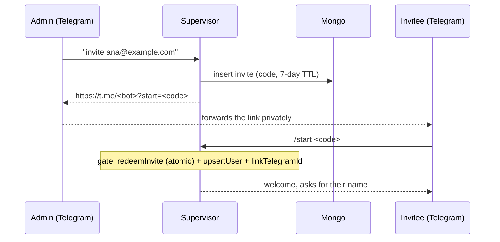

# Identity and access control

This doc covers users, invites, and authorization as they work today.

## Model

A person's canonical identity is their **Google email** (lowercase). Every other identity is linked to it or derived from it:

```
email (canonical, users collection)
├── telegramId     linked identity. Set when an invite is redeemed (or by seed)
├── discordId      linked identity, optional. Set via linkDiscordTool
├── resourceId     owner of the agent's memory. The email, for new DM threads
└── threadId       conversation. `<email>:web` on the web, a UUID on Telegram/Discord
```

**Telegram is the signup channel and the notification channel**, so every user has a `telegramId`. Discord is a secondary channel added on top of an existing identity. Nobody can sign up through it.

The `users` collection in Mongo (`src/business/models/user.model.ts`):

| Field        | Type                  | Notes                                            |
| ------------ | --------------------- | ------------------------------------------------ |
| `email`      | string                | Canonical, lowercase. Unique index.              |
| `name`       | string                | Editable via `setMyNameTool`.                    |
| `role`       | `'admin' \| 'member'` | Only admins can invite.                          |
| `telegramId` | string (optional)     | Sparse unique index: one Telegram account per user. |
| `discordId`  | string (optional)     | Sparse unique index. Secondary channel, set via `linkDiscordTool`. |
| `addedAt`    | number (unix)         |                                                  |
| `preferences.notifications` | boolean | Opt-in to notifications, set via `subscribeTool`. Default `false`. |

**Being in `users` means being authorized**, for both the bots and the app. There are no separate allowlists.

## Boot: admin seed

`ensureAdminSeed()` runs on every boot (`index.ts`). It creates the unique indexes idempotently and, if `ADMIN_EMAIL` is set, upserts the admin with `role: 'admin'`. `ADMIN_TELEGRAM_ID` is re-applied on every boot. `ADMIN_NAME` is only used on insert (`$setOnInsert`), so changing it in `.env` later does nothing. Without `ADMIN_EMAIL` the seed is skipped with a warning and no one is authorized.

## Chat access: the gate

`createChannelGate()` (`src/mastra/lib/channel-gate.ts`) runs **before** a message reaches the agent, on all three channel entry points (`onDirectMessage`, `onMention`, `onSubscribedMessage`). An unknown sender costs no tokens and never touches memory:

1. If the sender matches a user, the message goes to the agent.
2. Otherwise, only a `/start <code>` message (an invite deep link) is considered. Anything else is **silently** ignored.
3. Redemption is atomic (`findOneAndUpdate`: an unused, unexpired invite is marked used). If two redemptions race, one wins and the other gets null.
4. Redeeming links the `telegramId` to the invite's user. Only then does the message reach the agent.

The gate works across channels. The platform comes from `thread.adapter.name`, and `findChannelUser` (`lib/channel-user.ts`) maps it to the right lookup (`telegramId` or `discordId`). ID spaces don't cross, so a valid `telegramId` doesn't open the door on Discord. A platform with no mapped identity is rejected by default, so plugging in a new adapter without mapping its identity lets nobody in.

## Discord: secondary channel

There's no onboarding through Discord: signup and notifications stay on Telegram. A signed-up user asks from chat to link their account, and the supervisor calls `linkDiscordTool`. The tool writes `discordId` onto the email from the `resourceId`, never onto an email the model names. The sparse unique index rejects an ID already owned by another account. The tool returns that as `already-taken` instead of failing, since a person types the number.

The channel is **opt-in per environment**. `createDiscordAdapter()` throws in its constructor when credentials are missing, so without `DISCORD_BOT_TOKEN` + `DISCORD_APPLICATION_ID` + `DISCORD_PUBLIC_KEY` the adapter isn't registered.

Like Telegram, Discord gets plain text. The OpenUI prompt is only added when `CHANNEL_KEY` is `web`, and only `web-thread.ts` sets that.

## Invites

Only admins can invite, and they do it from chat: the supervisor calls `createInviteTool` with the invitee's Google email. The tool doesn't take a name (it comes from the Google profile). It returns a `t.me/...?start=<code>` link that the admin forwards to the invitee privately.



Details:

- The user is created **when the invite is redeemed** (via Telegram `/start`), not when the invite is generated. They can only sign in to the app after redeeming.
- Invites are single-use and expire after 7 days (`INVITE_TTL_SECONDS`).
- Whoever opens the link becomes that person, because their `telegramId` gets linked to the invite's email. That's why the link has to be sent privately.
- If the code matches no valid invite (expired, used, or nonexistent), nothing is consumed and the bot sends the generic invalid-invite message.
- If the code does match but provisioning the user fails (e.g. Mongo is down), the code **is already consumed** by the atomic `findOneAndUpdate`. The bot tells the invitee to ask for a new link, and an admin has to generate another invite.

## App access: Google id_token

mostro-app (Android and web) signs in with Google on the client and sends the `id_token` as a bearer token. `createGoogleAuth()` (`src/mastra/lib/google-auth.ts`) sets up `MastraAuthGoogle` in bearer mode with `GOOGLE_CLIENT_ID` and verifies the token against Google's JWKS (signature, `iss`, `aud`, `exp`). The signature proves *who* the caller is, not *whether they're allowed in*. That's decided by `authorizeUser` via `assertInvitedAndSyncName`, which requires the email to exist in `users`: the same rule the bot uses, with no separate list. Without `GOOGLE_CLIENT_ID` the provider isn't created and a warning is logged. Client contract: [expo-auth.md](expo-auth.md).

`createServerAuth()` (`src/mastra/lib/server-auth.ts`) combines this provider with `SimpleAuth` (`STUDIO_API_KEY`) through `CompositeAuth`. The first provider that authenticates wins.

The memory `resourceId` maps to the email, same as in the bot (`mapUserToResourceId` in the provider), so resource memory (who the person is, what they asked for) is shared across channels. The raw history isn't: each channel has its own thread (see below).

**There are two Google integrations, and they don't share credentials.** App login uses `GOOGLE_CLIENT_ID`. Sending email to providers uses `GMAIL_MAILER_*`, a different OAuth client (it can live in the same Google Cloud project). Someone signing in never sees a Gmail access prompt, because consent follows each request's scopes and login only asks for `openid email profile`. Details in [GUIDE.md](GUIDE.md).

Exception: the Telegram channel webhook (`/api/agents/*/channels/telegram/webhook`) stays public because it has its own protection (`TELEGRAM_WEBHOOK_SECRET_TOKEN`). If the auth middleware covered it, the bot would stop working.

## Memory: resourceIds

Who "owns" each conversation's memory:

- **Channel default**: `telegram:<userId>`. This is still the fallback for groups, and a fail-safe when the resolver can't find the user.
- **`resolveResourceId`** (in the supervisor): for **new** DM threads, it resolves the sender to their canonical email, using the `platform` Mastra passes in to pick the lookup. It only runs when a thread is created; existing threads keep their owner. As a result, memory is keyed by email, and the app, Telegram, and Discord share resource memory with no migration. The same person writing on two channels ends up with one `resourceId`.
- **No sub-agents**: the supervisor calls tools directly (pinned or via `search_tools`), so tools see the user's `resourceId` as-is, with no suffix.

## Memory: threadIds

Each channel resolves its thread differently, and the difference is on purpose.

**Web: `<email>:web`, derived on the backend.** The threadId decides which memory gets read, so it can't come from the browser: whoever sent it could read someone else's conversation. `webThreadMiddleware` (`lib/web-thread.ts`) runs as middleware on both browser-facing routes, `/chat/:agentId` (AI SDK) and `/agents/mostro-supervisor/openui` (AG-UI/OpenUI). It runs after auth, on the same `RequestContext`. It reads the email that auth stored in `MASTRA_RESOURCE_ID_KEY` and writes `MASTRA_THREAD_ID_KEY` as `channelThreadId(email, 'web')`. If there's no email in the context, it returns 401.

This holds because both keys are **reserved** in Mastra: `mergeRequestContext` drops them if they come from the body (`isReservedRequestContextKey`), and during agent execution the `RequestContext` takes precedence over args. Sending your own `threadId`, `resourceId`, or `requestContext` in the request changes nothing: the message still lands in the token owner's thread. This was verified against a running server, not just by reading the bundle.

**Telegram: a Mastra UUID, looked up by metadata.** `resolveTelegramThread` finds the thread whose `channel_externalThreadId` is `telegram:<id>`. We considered switching to `<email>:telegram` for symmetry and decided against it:

- **`null` is a gate, not a miss.** The 5 notification steps skip when it returns `null`, which is exactly the case of a user who never linked Telegram. A computed ID always exists, so that check would have to be re-added in all 5 places, and the lookup we wanted to avoid would come back anyway, just scattered.
- **Telegram already has its own thread identity**: the chat. Deriving the ID from the email throws away information the channel gives us for free. The web has no such alternative: the `id_token` email is the only identity available, which is why it's derived there.
- **Groups.** Today there are only DMs, but without a chat suffix a group would mix with the DM and split into one thread per participant. The current scheme already supports groups; the deterministic one would need surgery (`thread.isDM` and two rules instead of one).

Still unverified: where the adapter gets the outbound `chat_id` from. If it comes from the user record rather than the thread metadata, the deterministic scheme would work for DMs, and the decision could be revisited.

The ID convention lives in `lib/channel-thread-id.ts`: a single place, even though only the web uses it to write IDs today.

## Environment variables

Identity variables only. The email-sending ones (`GMAIL_MAILER_*`, `*_EMAIL_TO`) are in [GUIDE.md](GUIDE.md).

| Variable                     | Required | Role                                                                  |
| ---------------------------- | -------- | --------------------------------------------------------------------- |
| `ADMIN_EMAIL`                | yes*     | Admin email to seed. Without it, no one is authorized.                |
| `ADMIN_NAME`                 | no       | Admin name. Only applied when the user is created.                    |
| `ADMIN_TELEGRAM_ID`          | no       | Links the admin's Telegram without going through an invite.           |
| `DISCORD_BOT_TOKEN`          | no‡      | Bot token. Enables the Discord channel.                               |
| `DISCORD_APPLICATION_ID`     | no‡      | Discord application ID.                                               |
| `DISCORD_PUBLIC_KEY`         | no‡      | Verifies the Discord webhook signature.                               |
| `GOOGLE_CLIENT_ID`           | no†      | Google OAuth client ID. Enables mostro-app login (bearer `id_token`). |
| `STUDIO_API_KEY`             | no†      | 32+ chars. Admin token for Studio (see [studio-prod.md](studio-prod.md)). |

\* Optional in the zod schema but required in practice: without an admin, no one can invite. None of these variables may be present **with an empty value**, since zod checks `min(...)` and the boot fails.

† Each is optional, but **at least one** must be set. With no provider the server would be open, so `createServerAuth()` stops the boot.

‡ All three or none. With all three the Discord channel is registered; with none it doesn't exist. With only some, the adapter throws in its constructor.

## Known limitations

Changing a user's email means a manual migration. There's no user revocation or fine-grained roles yet.
