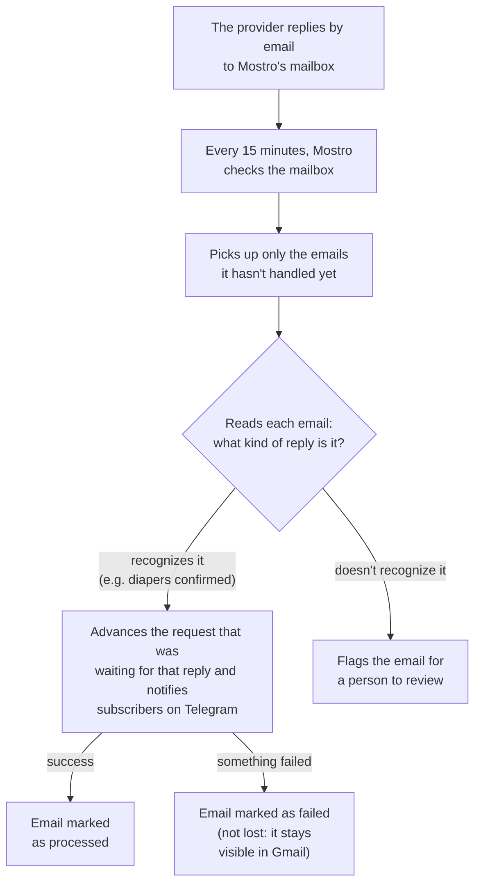

# Inbox pipeline: inbox-manager, mail-classifier, outcome-processor

Each domain (diapers, meds, refunds) has a poll workflow that runs every 15 minutes and handles provider replies in Mostro's mailbox. The pipeline is built from three independent modules, orchestrated by each poll workflow's step. None of them knows about the other two.

## The idea, without the jargon



Every email gets two labels in Mostro's Gmail: **what it was** (e.g. "diapers confirmation") and **how it ended** (processed, failed, or needs review). An email with no outcome label is retried on the next pass, so nothing gets lost silently.

The "rules" that tell Mostro which kinds of reply exist and what data to pull from each aren't in the code. They're loaded separately and can change without touching the program.

## The pipeline in detail

```mermaid
flowchart TD
    CRON(["cron every 15 min"]) --> INIT
    INIT{"manager.initialized?"}
    DEFAULT{"isDefault?"}

    subgraph MONGO["Mongo"]
        RULES["findActiveRules(domain)<br/>pointer (classifiers) → active snapshot<br/>(classifier-snapshots)<br/>null if the domain has no rules"]
    end

    subgraph IM["inbox-manager: the only module that talks to Gmail"]
        TRANSLATE["init(mastra)<br/>translates queryDescription → Gmail query<br/>+ -label:outcome.* exclusions"]
        FETCH["fetch()<br/>emails without a status label, oldest → newest<br/>strip-mail-body + resolve-mail-year-month"]
        LABEL["applyLabel(classification label)<br/>e.g. diapers.confirmed"]
        REVIEW["applyLabel(outcome.review)<br/>manual intervention"]
        COMPLETED["applyLabel(outcome.completed)"]
        FAILED["applyLabel(outcome.failed)"]
    end

    subgraph MC["mail-classifier: pure, no side effects"]
        CLASSIFY["classifyMail(mastra, text, rules)<br/>1. classify (condition + few-shot)<br/>2. extract (snapshot JSON Schema)<br/>3. validate with ajv"]
    end

    subgraph OP["outcome-processor"]
        PROCESS["processOutcome(handlers, label, ctx)<br/>label → handler → @lib/*-run.ts<br/>(resumes the suspended run)"]
    end

    INIT -->|"no (first run)"| TRANSLATE
    INIT -->|"yes"| RULES
    TRANSLATE --> RULES
    RULES --> FETCH
    FETCH -->|"for each email"| CLASSIFY
    CLASSIFY --> LABEL
    LABEL --> DEFAULT
    DEFAULT -->|"yes (default-outcome)"| REVIEW
    DEFAULT -->|"no"| PROCESS
    PROCESS -->|"ok / no handler"| COMPLETED
    PROCESS -->|"fails"| FAILED
    CLASSIFY -.->|"error (extraction invalid, etc.)"| FAILED
```



The diamonds (`initialized?`, `isDefault?`) are decisions made by the orchestrating step (`poll-<domain>-mailbox.step`); the modules don't know about each other.

## inbox-manager (`src/mastra/lib/inbox-manager/`)

The gateway to Gmail: it reads emails and applies labels. It doesn't classify or run side effects.

- **Config lives in code** per domain (`workflows/<domain>-poll/<domain>-inbox.config.ts`), and it's just a natural-language `queryDescription` ("emails from the diaper provider in the last 30 days").
- **`const` + idempotent `init(mastra)` pattern**: the instance is declared at module level, where `mastra` doesn't exist yet. `init(mastra)` translates the natural-language query into Gmail syntax with a **single** call to the `inboxClassifier` agent, and later cron cycles reuse it.
- **Static exclusions**: `-label:outcome.completed -label:outcome.failed -label:outcome.review` is appended to the translated query. No status label means not processed. The exclusions don't depend on the classification rules, so they don't have to be derived from Mongo.
- `fetch()`: lists messages (Gmail returns newest first, so the list is reversed to process oldest first), cleans the body (`strip-mail-body`: cheerio for HTML, `email-reply-parser` for quotes), and resolves a deterministic date from the oldest `X-Received` header (`resolve-mail-date`). The email's `year` and `month` come from that date.
- `applyLabel(messageId, label)`: creates the Gmail label if it doesn't exist.

## mail-classifier (`src/mastra/lib/mail-classifier/`)

Pure functions over text + rules: no Gmail, no side effects, no cache.

- **Rules live in Mongo** (not in code) and are read on **every run** via `classifierRepository.findActiveRules(domain)`. Publishing a new snapshot takes effect on the next cron cycle, with no redeploy.
- If the domain **has no rules yet**, `findActiveRules` returns `null` and the poll skips the run with a warning, leaving the mailbox alone. That's the expected state while the matching `CLASSIFIER_RULES_<DOMAIN>` hasn't been loaded. A pointer to a snapshot that doesn't exist **does throw**, though: that's corruption, not missing config.
- `classifyMail(mastra, text, rules)` → `{ label, data?, isDefault }`:
  1. **Classification**: a prompt with each outcome's `condition` plus few-shot from `examples.match[]` / `examples.no_match[]`. The LLM picks exactly one label (enum = outcome labels + the default-outcome label).
  2. **Extraction** (only if the chosen outcome has `extract`): a second call with `structuredOutput`, passing the snapshot's **plain JSON Schema** straight to the LLM.
  3. **Validation**: `ajv` checks the extracted data against that same schema. If it fails, an error is thrown and the step marks the email `outcome.failed`. This is the safety net before any workflow gets touched.
- The rules JSON format is documented in [clasificador.md](clasificador.md).

## outcome-processor (`src/mastra/lib/outcome-processor/`)

Runs the side effect tied to a classification label.

- **Registry lives in code** per domain (`workflows/<domain>-poll/<domain>-outcome-handlers.ts`) as a `label → handler` map. Handlers parse `data` with the domain's Zod resume schemas and call the `@lib/*-run.ts` helpers (which resume the saved run, check it's suspended, and target the right step).
- **Run resolution**: handlers with a date extracted from the email (`deliveryDate` / `depositDate`, `YYYY-MM-DD` guaranteed by the schema) build the run's month by combining the **context year** (from the `X-Received` header, reliable) with the **extracted date's month** (`monthOfIsoDate`). Reply emails only give day/month ("16-01"), so the LLM guesses the year and it can't be trusted. The month, though, points at the run of the request being confirmed, even if the reply arrives in a different month. Handlers without an extracted date (`meds.acknowledged`, `refunds.acknowledged`, `refunds.approved`) use the context `year` / `month` as-is.
- `processOutcome(handlers, label, ctx)` → `{ ok } | { ok: false, reason }`. A label **with no registered handler** counts as completed with no side effects.
- ⚠️ The map's labels **must match** the ones in the JSON seeded into Mongo. A classified label missing from the registry ends up `outcome.completed` and runs nothing.

## Labels: two orthogonal dimensions

Each processed email gets two dot-notation labels:

| Dimension | Examples | When it's applied |
| --- | --- | --- |
| **Classification** | `diapers.confirmed`, `meds.unknown` | As soon as the LLM classifies (comes from the Mongo snapshot) |
| **Status** | `outcome.completed` / `outcome.failed` / `outcome.review` | Based on the processing result |

- `outcome.completed`: the handler succeeded (or the label has no handler).
- `outcome.failed`: the handler failed, extraction didn't validate, or an unexpected error occurred (best-effort).
- `outcome.review`: matched the default-outcome. Needs manual intervention; nothing retries it.

An email can end up `diapers.confirmed` + `outcome.failed`: you know **what it was** and **that it failed**. Since the query excludes all three status labels, retries are at-least-once: a crash before the status label is applied means the email gets reprocessed on the next cycle.

## Rules in Mongo: versioned snapshots

Two collections (models in `src/business/models/`, repository in `src/business/repositories/classifier.repository.ts`):

- **`classifier-snapshots`** (immutable): `{ domain, version, author, changelog, classification_rules }`, unique index on `(domain, version)`. Publishing a change always creates a new version (`version = max + 1`).
- **`classifiers`** (mutable pointer): `{ domain, version }`, unique index on `domain`. Points to the active snapshot. Rolling back means moving the pointer to an earlier version.

### Seed

Rules JSON files contain sensitive data and live **outside the repo**. There are per-domain templates with placeholders in [classifier-rules/](classifier-rules/), with labels and extract schemas already aligned with the handlers. The script takes the path:

```bash
pnpm seed:classifier -- --domain diapers --file /external/path/diapers-rules.json --author "Alex" --changelog "initial seed"
```

It validates the minimal shape (non-empty outcomes, default-outcome present), inserts the snapshot with an auto-incremented version, and moves the pointer.

## Orchestration (poll step)

`workflows/<domain>-poll/steps/poll-<domain>-mailbox.step.ts`, one per domain (no generic factory, KISS):

```
if !manager.initialized → manager.init(mastra)          // translates the query once
rules = classifierRepository.findActiveRules(domain)    // Mongo, every run
if !rules → warning; exit ok                            // domain without rules: mailbox untouched
mails = manager.fetch()                                 // oldest → newest
for each mail:
    { label, data, isDefault } = classifyMail(...)
    applyLabel(mail, label)                             // classification, immediately
    if isDefault → applyLabel(mail, outcome.review); continue
    result = processOutcome(handlers, label, { mastra, text, month, data })
    applyLabel(mail, result.ok ? outcome.completed : outcome.failed)
on catch (per mail): log + applyLabel(outcome.failed) best-effort; one broken email doesn't stop the loop
```

**Why classification and workflow advancement are separate**: the model only answers "what is this email" and "with what data". It never decides which run or step to touch. That stays in code (`resolveMailYearMonth` + the `*-run.ts` resume helpers), so a bad classification can at worst mislabel an email. It can't corrupt a run's state.

## Operational notes

- The `gmail.modify` scope is needed to read replies and apply labels (see [GUIDE.md](GUIDE.md), Gmail setup).
- **Old emails with the previous label scheme** (`mostro/...`) have no `outcome.*` labels, so the new query would pick them up again. The natural-language query is limited to "last 30 days"; if they get in the way, apply an `outcome.*` label to them manually in Gmail once.
- Failed emails aren't retried automatically, and there's no Telegram alert when something lands in `outcome.failed` / `outcome.review`.
- **Known limitation**: for handlers without an extracted date, resolving by `X-Received` assumes the run for the month the email was sent is still suspended when the reply arrives. Handlers with an extracted date take the month from the email's date but the year from the context, so they assume the request and the delivery/deposit fall in the same year (a January confirmation arriving the previous December, or the reverse, would map wrong). The real fix for threads crossing months is to tie each email thread to the run that started it (store the outgoing email's `threadId` in the workflow state). Not implemented.
- The dry-run CLI (`classify:eml`) was removed with this architecture; it'll be rebuilt against the new modules later.
